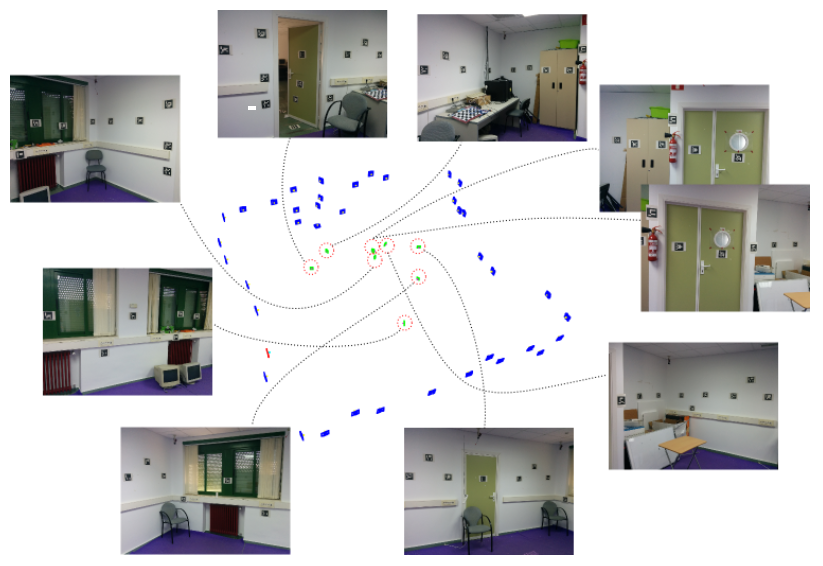
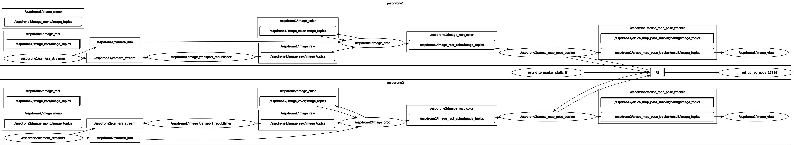
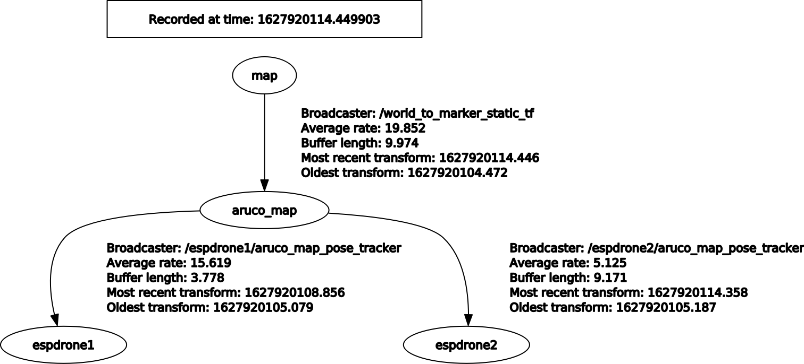

# espdrone-aruco-ros
This repository contains ROS packages for ESP-drone camera data processing and ArUco marker detection.

This stack works in conjunction with [`espdrone-ros`](https://github.com/NelsenEW/espdrone-ros), a set of ROS packages for interfacing with the ESP-drone using ROS, including for fetching camera image from the drone. Both this repository and `espdrone-ros` are specialized for the NTU EEE UAVIONICS DIP project.

This stack as well as `aruco-3.1.12`, the required dependency not in this repository, have been tested on **Ubuntu 20.04 and ROS Noetic**.


## Overview
The packages in this repository allow for **processing the camera data from multiple ESP-drones concurrently**, specifically to:
* Process the camera image using ROS `image_proc`, e.g. for camera undistortion and convertion to grayscale (`MONO8`) format
* Perform pose estimation (position and orientation) of the camera/drone using multiple [ArUco](https://www.uco.es/investiga/grupos/ava/node/26) fiducial markers scattered across the drone's environment, forming a [marker map](http://www.uco.es/investiga/grupos/ava/node/57)

Pose estimation is possible if at least 2 ArUco markers are in the field of view of the drone's camera.

The stack has been tested to run on a Raspberry Pi 4B (8GB model) running Ubuntu 20.04 MATE, though a computer with a more powerful CPU is highly recommended if you intend to launch more than one ESP-drones.


## Setup
The steps here assume that you already have ROS and Catkin workspace setup. If you have not done so, check out how to install ROS in the [official Wiki](http://wiki.ros.org/noetic/Installation/Ubuntu), then run these to create a Catkin workspace:
```bash
source /opt/ros/noetic/setup.bash
mkdir -p ~/catkin_ws/src
cd ~/catkin_ws
catkin build

# Automatically source setup.bash for convenience.
echo "source ~/catkin_ws/devel/setup.bash" >> ~/.bashrc
source ~/.bashrc
```
If you already have ROS and Catkin workspace setup:
1. Download the `aruco-3.1.12` library [from here](https://sourceforge.net/projects/aruco/files/3.1.12/), then put it in your home directory (i.e. `/home/<your_username>/`). 
2. Clone this repository to your Catkin workspace's `src` folder.  
   ```bash
   cd ~/catkin_ws/src
   git clone https://github.com/AndrianH18/espdrone-aruco-ros.git
   ```
3. Build the workspace:
   ```bash
   cd ~/catkin_ws
   catkin build
   ```


## Usage

Here are the steps to perform (in order):

1. Preparing the room (environment) the drones will fly in
2. Creating an ArUco map file
3. Calibrating the drones' cameras
4. Launching the drones

See the following for more in-depth guides.

***Note for DIP students:** steps 1 and 2 might have already been done for you. Please consult to us to verify this.*

### 1. Preparing the Room (Environment)

Enough number of ArUco markers need to be pasted evenly across the room/environment the drones will fly in (remember that pose estimation only works if at least 2 ArUco markers are visible by the drone's camera). This step creates an ArUco map, where multiple markers form a unique reference system.

**Example (obtained from [here](http://www.uco.es/investiga/grupos/ava/node/57)):**


There are several dictionaries (variants) of ArUco markers available. We recommend using the `ARUCO_MIP_36h12` library available for download [here](https://sourceforge.net/projects/aruco/files/aruco_mip_36h12_pdf.zip/download). 

**Important notes!**
* Each ArUco marker has its own numerical ID, 0 to 249 in the case of `ARUCO_MIP_36h12`. Make sure to keep track of which marker has which ID when you print them. Each marker has its ID faintly written on the bottom left corner.
* Do not use multiple markers with the same ID for the same room/environment.
* All markers must be of the same size.
* Try to paste all the markers upright.

### 2. Creating an ArUco Map File
An ArUco map file is required to be able to estimate the drones' pose. This file describes the ID and position of every ArUco marker in the environment we have prepared in the previous step.

To create the map file, we use a marker mapper program, which takes in pictures or video capturing the ArUco markers in the room and outputs a file describing the map. We do not have to use the drone's camera for creating the map file.

We recommend using the [ArUco MarkerMapper app](https://play.google.com/store/apps/details?id=com.uco.avaappbeta&hl=en_SG&gl=US) (only available for Android) as the phone has built-in camera and the app is quite easy to use. Alternatively, the program is also available for Linux and Windows [here](https://sourceforge.net/projects/markermapper/files/?source=navbar). Refer to the [official webpage](http://www.uco.es/investiga/grupos/ava/node/57/) for guide on how to use the Linux/Windows program.

The app/program will output a YML file as the map. **Copy this file to `espdrone-aruco-ros/espdrone_aruco_bringup/config/environment/aruco_maps`**. 

### 3. Calibrating the Drone's Camera
Since we rely on vision markers for localization, it is important to calibrate the camera of the drone (especially for wide-angle lenses). Perform the following steps **for each drone (camera)**:
1. Prepare a camera calibration checkerboard, such as [this one](https://github.com/AndrianH18/espdrone-aruco-ros/blob/main/documentation/checkerboard_7x9_20mm.pdf). Make sure to **print it on an A4 paper with 100% scale (no zooming)**. Then, turn on the ESP-drone and make sure that the drone and your computer are connected to the same Wifi network.
2. Launch the following launch file for camera calibration, **specifying the IP address of the drone** and the checkerboard size and square size (in meters). For example:
   ```bash
   roslaunch espdrone_aruco_bringup espdrone_cam_calib.launch drone_ip_addr:=192.168.0.112 checkerboard:=7x9 square_size:=0.02
   ```
   A calibration window showing the camera feed from the drone should then appear. A warning on the terminal saying "Camera calibration file not specified" is normal.
3. Try to get all bars on the calibration window to show green and be long enough, then click "Calibrate". The calculation can take some time. *It is okay to switch the drone off.*
4. After the calibration is complete, click "Save" on the calibration window. The full path to the saved calibration data is `/tmp/calibrationdata.tar.gz`. After the terminal reports that the calibration data has been saved, you may shut down the ROS (`Ctrl` + `C` on the terminal).
5. Unzip the saved file, then copy and rename the calibration file to the `espdrone_aruco_bringup` folder. **Replace `<new_file_name>` below with a sensible name, so you can identify which drone the camera is attached to.**
   ```bash
   # Unzip the calibration data...
   cd /tmp
   tar -xvf calibrationdata.tar.gz

   # Copy the file to 'espdrone_aruco_bringup' and rename it...
   cd ~/catkin_ws/src/espdrone-aruco-ros/espdrone_aruco_bringup/config/espdrone/camera_calib/
   cp /tmp/ost.yaml ./<new_file_name>.yaml
   ```

### 4. Launching the Drones
You can launch multiple ESP-drones at once in the same envinronment. Before doing so, you have to create several configuration files in YAML format:
1. **Drone Configuration File**
    * Describes the drone's IP address, whether you want to visualize the camera stream, and which calibration file is used (**make sure to use the correct file for the camera attached to the drone!**).
    * **Each drone has their own configuration file**.
    * The title of the configuration file determines the drone's name.
    * File location: `espdrone_aruco_bringup/config/espdrone`.
    * Example:  
      A file titled `espdrone1.yaml` with the following content:
      ```yaml
      drone_ip_addr   : "192.168.0.112"           # drone's IP address
      camera_info_file: "espdrone1_640x480.yaml"  # which calibration file to use
      visualize_output: "true"                    # see camera stream with detected markers drawn? 
      ```
2. **Environment/Map Configuration File**
    * Describes the ArUco marker size, the map file to use, parameters related to ROS TF library (you shouldn't have to modify this).
    * Only one file needed for each environment.
    * File title has no effect; it is only for identifying which environment the configuration file describes. 
    * File location: `espdrone_aruco_bringup/config/environment`.
    * Example:  
      A file titled `iot_lab.yaml` with the following content:
      ```yaml
      aruco_marker_size     : 0.16                        # size in meters
      aruco_map_config_file : "iot_lab_map.yml"           # which map file to use
      world_to_marker_map_tf: "0 0 0 0.5 -0.5 -0.5 0.5"   # world to marker map static TF
      marker_map_frame      : "aruco_map"                 # marker map frame ID
      world_fixed_frame     : "map"                       # world fixed frame ID
      ```

After the configuration files have been setup, the drones can be launched by using the `launch_espdrone_aruco.py` Python script inside the `espdrone_aruco_bringup` package, specifying the drone(s) to launch and the environment.

**Example:** to launch `espdrone1` and `espdrone2` described by `espdrone1.yaml` and `espdrone2.yaml`, in the IoT Lab environment described by `iot_lab.yaml`...
```bash
cd ~/catkin_ws/src/espdrone-aruco-ros/espdrone_aruco_bringup/script
python3 launch_espdrone_aruco.py -d espdrone1 espdrone2 -e iot_lab

# or alternatively

python3 launch_espdrone_aruco.py --drones espdrone1 espdrone2 --env iot_lab
```

 The result of the pose estimation can be obtained from the ROS topic `/<drone_name>/aruco_map_pose_tracker/pose`.

 In another terminal:
```bash
rostopic echo /<drone_name>/aruco_map_pose_tracker/pose
```

The estimated position (pose but without the orientation data) is also published to `/<drone_name>/aruco_map_pose_tracker/position`, but this topic is remapped to `/<drone_name>/external_position` (a topic subscribed by `espdrone_server`). As the result, the position estimation is fed into the ESP-drone's Kalman filter as input data.

 If visualization is enabled inside the drones' YAML config files, a window showing the camera stream and ArUco markers detected for each drone will appear.


## Notes Regarding ROS Implementation

### ROS Nodes
The figure below depicts the ROS node graph of the stack when processing camera stream and estimating pose of 2 ESP-drones, `espdrone1` and `espdrone2`.



### ROS Transform (TF)
Transform is also published for each ESP-drone. As the `/<drone_name>/aruco_map_pose_tracker` node estimates the pose, it is also the node publishing the transform.
  


The transform published by `aruco_map_pose_tracker` is from the `aruco_map` frame to the drone's frame (`espdrone1` and `espdrone2` in the figure). The pose estimation result in the `/<drone_name>/aruco_map_pose_tracker/pose` topic is really just the transform from the `map` frame to the drone's frame.

Both `map` and `aruco_map` are fixed frames; the (static) transform from `map` to `aruco_map` is for adjusting the coordinate system, e.g. shifting the origin and rotating the axes so that the +z axis points up instead of some direction parallel to the ground. The static transform from `map` to `aruco_map` is described in the environment configuration file by the key `world_to_marker_map_tf`.


## References
**ArUco official webpage:** http://www.uco.es/investiga/grupos/ava/node/26

**ArUco library official documentation:** https://docs.google.com/document/d/1QU9KoBtjSM2kF6ITOjQ76xqL7H0TEtXriJX5kwi9Kgc/edit
